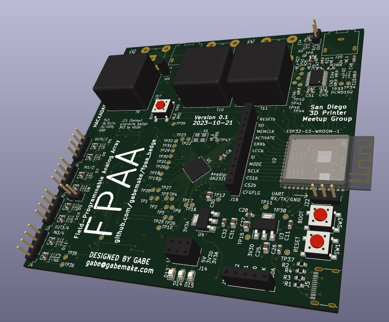

# FPAA Add-on for SuperCon 2023 badge

## SuperCon Badge info
Main article: https://hackaday.com/2023/10/18/2023-hackaday-supercon-badge-welcome-to-the-vectorscope/

Key points:
- RP2040 with DAC/ADC connected to PIOs
- Round display also on PIOs
- Micropython based SW

## FPAA Addon concept

What is an FPAA?
- Field-Programmable Analog Array
- Configurable array of analog components
  - Gain
  - Filter
  - Mix
  - more...
- 4 differential I and O ports
- 3 bidirectional differential ports
- SPI-ish configuration interface
- a.k.a. dpASP
- Datasheet: https://www.anadigm.com/_doc/DS231000-U001.pdf

Other things on the board:
- Connectors and single-to-differential conversion matching to badge IO
- ESP32-S3 to program FPAA (via web or otherwise)
- RBGLEDs all the way around
- a button
- BNC connectors + 3.5mm jack for external inputs or output
- SD Card reader

What to do with the addon?
- Figure out how to program and use a FPAA
- Maybe do a cool windows media player -like visualizer for music
- Get lots of practice soldering 0603 resistors